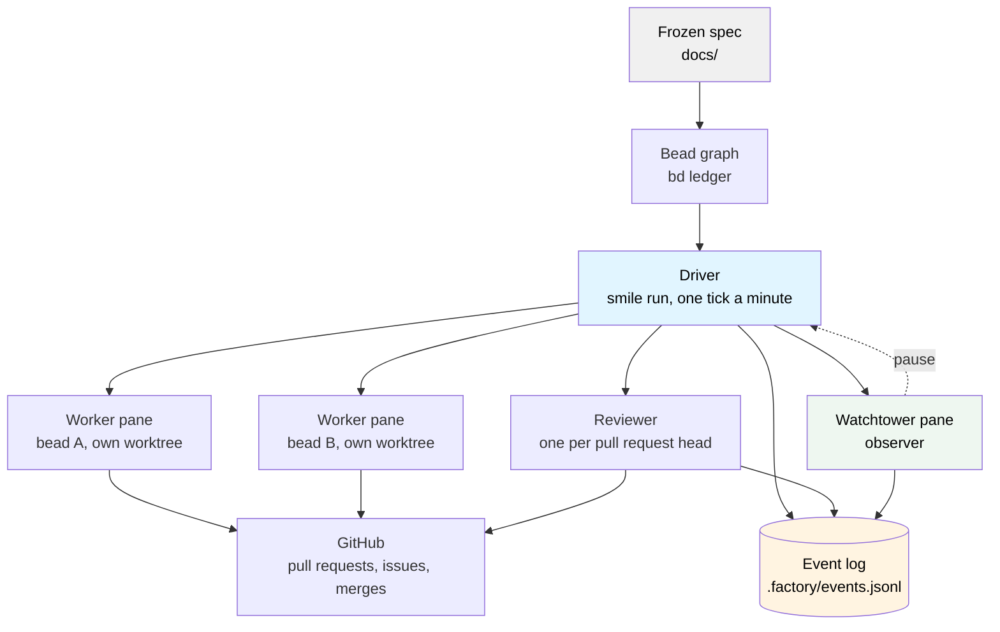
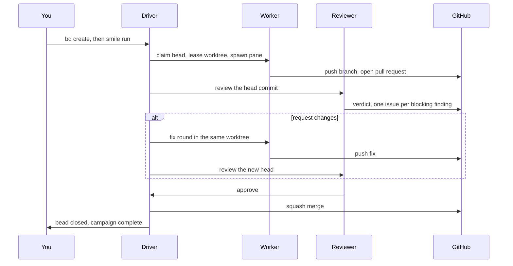
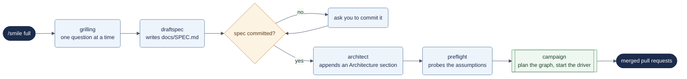
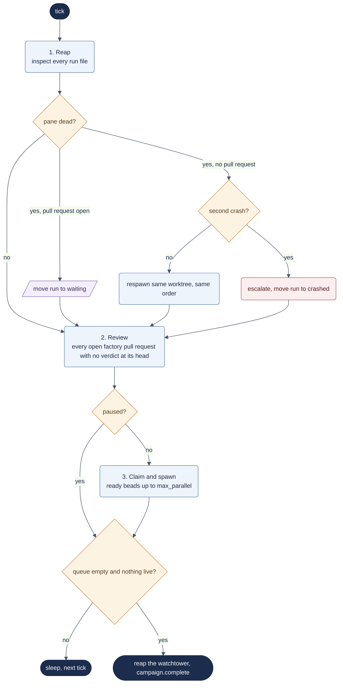
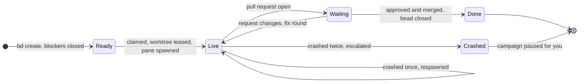

# SMILE software factory

**A deterministic build loop that turns a queue of issues into a queue of reviewed pull requests, with coding agents in visible panes and an independent reviewer on every merge.**

## Overview

SMILE stamps a small runtime into any git repository and drives it from there. You write a spec, break it into beads (issues in the `bd` tracker), and start the driver. Each tick the driver claims every ready bead, gives it a worktree and a pane of its own, waits for the pull request, hands the pull request to a reviewer, and merges only what the reviewer approved. Nothing in the loop is an agent: the sequencing is a script, so the same campaign behaves the same way every run.

### What problem does this solve?

| Challenge | SMILE answer |
| --- | --- |
| One big agent owns its own loop, so nobody can say which step failed | Code owns the loop; agents own one bounded job each |
| "Done" means the agent stopped talking | Done means a reviewer approved the diff at that exact commit and the driver merged it |
| Agent state lives in a context window and dies with it | State lives in the bead graph, the event log, and GitHub; a killed driver restarts from those |
| Workers step on each other's files | One worktree per bead, leased from a pool, returned when the bead closes |
| Nobody watches the build | A watchtower pane reads the log, escalates, and can pause the campaign |
| A merge nobody reviewed slips through | `smile audit` lists every merged factory pull request without an approving verdict at its merge SHA |

### Architecture



The four lanes never call each other. They meet in the event log.

## Core concepts

### Beads 📿

The unit of work: an issue in the `bd` tracker with a title, a description, and dependencies. The driver only ever claims what `bd ready` lists, and `bd ready` never lists a bead whose blockers are open. Ordering a campaign is ordinary dependency edges.

### The spec 📜

A frozen document under `docs/`, committed to git. Workers read it when they build; the reviewer judges every diff against it. The planning ladder is advisory, but the freeze is enforced: a campaign refuses to start without a committed spec.

### The driver ⚙️

`smile run`. A script, not an agent. It repeats one tick every sixty seconds: reap finished panes, review open pull requests, claim ready beads, spawn workers, and exit when the queue is empty. It keeps nothing in memory that matters, so killing it mid-campaign loses nothing.

### Workers 👷

One coding agent per claimed bead, in its own worktree, in its own pane, holding a work order rendered from the bead and the spec. A worker ends by pushing a branch and opening one pull request whose body carries `Bead: <id>`. That one line is the whole link between GitHub and the bead graph.

### The reviewer 🔍

One reading agent per pull request head. It sees the diff, the spec, and every open review issue for that pull request, and answers in a fixed grammar: a verdict line and one line per blocking finding. It never edits. A blocking finding becomes a labelled GitHub issue; the worker is sent back for a fix round; the new head is reviewed again.

### Worktrees 🌳

Leased from a pool per bead and returned when the bead closes. A fix round reuses the same worktree, so the worker's branch and history are where it left them.

### Panes 🪟

Every agent runs in a pane of a real multiplexer, so you can read over its shoulder. tmux is the default; cmux and Herdr are the other two backends. The driver talks to all three through one seam of three verbs: spawn, alive, kill.

### The event log 📖

`.factory/events.jsonl`, one JSON line per event, seventeen event names, appended by every lane. It is the only shared truth. Narration, the watchtower, and the audit all read it and nothing else.

### The watchtower 🗼

A long-lived observer pane spawned at campaign start. It tails the log, keeps `.factory/watch.md`, and has exactly two powers: append an escalation event, and pause the campaign. It pauses when a bead crashes twice. It never resumes; that decision stays yours.

### Gates 🚧

`smile gate` decides what happens after an approve: merge automatically, hold everything for you, or hold only the beads you name. Gated approvals get a label and wait.

### The audit ✅

`smile audit` prints every merged factory pull request that no review approved at the SHA that merged. It should print nothing. That empty line is the factory's one promise.

## Installation

### Prerequisites

`smile doctor` checks all of them and prints one line each, in this order:

| Tool | Why |
| --- | --- |
| `uv` | The runtime runs as `uv run`; nothing is installed into your Python |
| `git` | The repository and one worktree per running bead |
| `gh`, signed in | Every pull request, issue, label, and merge goes through it |
| `claude` | The worker, the reviewer, and the watchtower are all agent processes |
| `bd` | The issue tracker the bead graph lives in |
| `treehouse` | The worktree pool the driver leases from |
| a multiplexer | One of tmux, cmux, or Herdr; each agent runs in a pane of its own |

Anything missing prints `missing <tool> <reason>` and doctor exits 1.

### Setup

```bash
# 1. Stamp the runtime, prompts, and skills into your repository
uv run /path/to/smile-software-factory/install.py /path/to/your/repo
cd /path/to/your/repo

# 2. Create .factory/, the bead tracker, and the config file
smile/smile init

# 3. Check every prerequisite
smile/smile doctor
```

Re-running the installer is safe. It reports `unchanged` for files it already stamped and `drifted` for files you edited since; `--force` overwrites those.

## Quick start

### Getting started

Open Claude Code in the stamped repository and type

```
/smile build add a --version flag to the CLI
```

That creates one bead from the prompt, starts the driver, and narrates until the pull request is merged.

### Basic workflow



### Example: a two-bead campaign

```bash
# 1. Write and freeze the spec
$EDITOR docs/SPEC.md && git add docs && git commit -m "spec"

# 2. Create the beads; --deps keeps the second one out of the ready list until the first closes
bd create "add hello.py with a --name flag" --description "uv run hello.py prints hello ..."
bd create "add test_hello.py" --description "..." --deps <first bead id>

# 3. Start the driver
smile/smile run

# 4. Follow along
smile/smile narrate
```

## Common workflows

Every workflow is one stamped skill, `/smile`, with the verb as its argument. The skill decides where to start by what already exists in the repository, never by what it remembers.

| Verb | What it does | Use when |
| --- | --- | --- |
| `/smile build <prompt>` | One bead from the prompt, driver started, narrated to the merge | A small change with no spec |
| `/smile dark` | Frozen spec to merged pull requests, no questions asked | The spec is done and you want the machine to run |
| `/smile full` | The whole ladder, one gate between stages | You want to be interviewed before anything is built |
| `/smile status` | Where the ladder stands, then `smile status` | Coming back to a repository |

### The planning ladder



`/smile dark` enters the same ladder at the freeze check, skips the interviews and the architect, runs preflight if its notepad is missing, and pre-approves the graph. Every stage is also its own skill (`/smile-grilling`, `/smile-draftspec`, `/smile-architect`, `/smile-preflight`, `/smile-campaign`), so you can run one alone and pick the ladder up later; the router finds the first missing artifact and resumes there.

### Raw CLI

The skills are ignition and narration. The engine is four commands.

```bash
bd create "..." --description "..."   # one bead per unit of work
smile/smile run                        # the driver; --once for a single tick
smile/smile narrate                    # what happened since you last asked
smile/smile pause                      # claim no new beads; smile resume lifts it
```

## The tick

Every sixty seconds the driver does exactly this, in this order.



## Monitoring and health

### Narration

`smile narrate` prints every event appended since the last call, escalations first, and remembers its offset. It is the one command to run when you come back to a campaign: call it, read the lines, call it again later.

### Status

`smile status` prints the current state and the last ten events. `/smile status` adds the ladder: which of spec, freeze, architecture, preflight, and campaign exist.

### The watchtower report

`.factory/watch.md` is the observer's running log, one line per event, with escalations called out. When a bead crashes twice the watchtower writes `watch.escalation`, then `driver.paused`, and stops there.

### Escalation

An escalation is an event, not an alert. The watchtower appends it, narration prints it first, and the campaign waits paused until you run `smile resume`. Nothing resumes on its own.

### The audit

```bash
smile/smile audit     # prints nothing when every merge was approved at its SHA
```

## Configuration

`smile init` writes `smile.config.yaml`. One `key: value` per line.

| Key | Default | Meaning |
| --- | --- | --- |
| `backend` | auto | Pane backend: `tmux`, `cmux`, or `herdr`; empty means the first one on PATH in that order |
| `worker.model` | `opus` | Model each worker is launched with |
| `worker.permission_mode` | `bypassPermissions` | Workers run unattended; their worktree is the boundary |
| `reviewer.models` | `opus` | Comma-separated; one review per model |
| `reviewer.timeout` | `600` | Seconds a review may take before it counts as failed |
| `max_parallel` | `3` | Beads in flight at once |
| `watchtower` | `on` | Spawn the observer pane |
| `merge` | `auto` | `manual` leaves every approved pull request for you |
| `base_branch` | `main` | Where pull requests target and merge |

## Advanced concepts

### Bead lifecycle

A bead's status is where its run file sits. No field is edited; the file moves.



### The multiplexer seam

```bash
smile/smile mux spawn <name> <cwd> <command> [args...]   # prints a handle
smile/smile mux alive <handle>                            # exit 0 while it runs
smile/smile mux kill <handle>                             # exit 0 even if already gone
```

A handle is `<backend>:<rest>`, so it names its own backend and nothing else has to track which one is in use. A pane inherits the multiplexer server's environment, not the driver's, so everything a worker needs travels on its command line.

### Why workers run in print mode

Everything the driver learns about a worker comes through `alive`. An interactive agent never exits, so its pane would never die and the driver would wait forever. A worker runs headless with permissions bypassed inside its own worktree, does its order, and exits.

### Skills

Nine skills are stamped beside the runtime, all prefixed `smile-` so they never collide with a skill of the same name installed elsewhere: `smile-code-writer` and `smile-code-reviewer` are what the worker and reviewer prompts point at; `smile-grilling`, `smile-draftspec`, `smile-architect`, `smile-preflight`, and `smile-campaign` are the ladder; `smile-test-writer` and `smile-watchtower` are helpers. The runtime never reads them; the prompts name them.

## Project roles

| Role | What it is | Interface |
| --- | --- | --- |
| **You** | Write the spec, approve the graph, lift pauses, read the audit | `/smile`, `bd`, `smile narrate` |
| **Driver** | Deterministic loop | `smile run` |
| **Worker** | One agent per bead, headless, in a pane | Spawned by the driver |
| **Reviewer** | One reading agent per pull request head | Run by the review lane |
| **Watchtower** | Observer with two powers: escalate, pause | Spawned at campaign start |

## Tips

- Keep beads small. One bead, one pull request, one review. A bead that needs three pull requests is three beads with dependencies.
- Freeze the spec before the campaign, not during. The reviewer judges against what is committed.
- Read `.factory/watch.md` before the raw log. Read the raw log before guessing.
- `smile run --once` is the fastest way to see what one tick would do.
- The audit is cheap. Run it after every campaign.

## Design documentation

- `docs/HOW-IT-WORKS.md`: the four lanes, the event log, the tick, the review lane, the watchtower, the seam, and the invariant, explained.
- `docs/RUNTIME-CONTRACT.md`: the normative contract for every command, exit code, event, and config key.
- `docs/SPEC.md`: the frozen design and the spike plan this repository was built from.
- `docs/PROCESS.md`: how the factory itself was built, spike by spike, with budgets.
- `docs/decisions.tsv`: the decision trail, one row per ruling, with evidence.

## Troubleshooting

### Doctor prints `missing gh-auth`

`gh auth login`, then run `smile/smile doctor` again. Every pull request and merge goes through `gh`, so nothing works without it.

### The campaign paused itself

A bead crashed twice. `smile/smile narrate` prints the escalation first. Look at the bead's run file under `.factory/runs/crashed/`, fix the cause, and `smile/smile resume`.

### A pull request was reviewed three times and skipped

The reviewer named no verdict three times in a row. The driver logs `watch.escalation` with `review failed 3 times` and moves on; review that pull request by hand with `smile/smile review <n>`.

### A worker's pane died within a minute

Run the worker's order by hand from its worktree with the same command line and read what it prints. The driver cannot tell a clean exit with no pull request from a crash; the worker's own output can.
